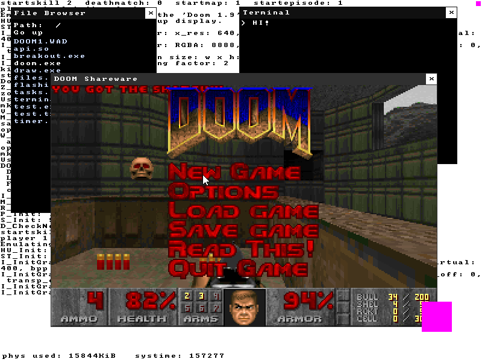

# Untitled 32bit Graphical OS



## Features/Limitations

* Higher half multitasking kernel
* Essential stuff like paging, interrupts, PS2 mouse/keyboard support
* FAT32 filesystem with LFN support
* Userspace
* Framebuffer graphics (using shared memory)
* Event system (using shared memory)
* Shared libraries
* A single userspace OS API a la winapi
* Libc using [baselibc](https://github.com/PetteriAimonen/Baselibc)
* Runs DOOM using [doomgeneric](https://github.com/ozkl/doomgeneric)

Currently relies on multiboot/grub to provide a ramdisk and a framebuffer. Does not have SMP support.

## Architecture/Motivation

This is a completely monolithic OS with a single userspace API for everything (task management, file I/O, window management, etc...). All an application needs to do is to include os.h and link against api.so. The kernel is not unix based.

I try to keep things as simple and understandable as possible whilst still being speedy. There are tons of security holes, that's not a priority right now.

I used these projects as reference for implementing the more tedious parts (Thanks!):
- [soso](https://github.com/ozkl/soso)
- xv6

## Building

Requires clang, 32bit libgcc (gcc-multilib on debian), NASM, mtools and xorriso.

To build:
```
make
```
To build and run (using qemu):
```
make run
```
