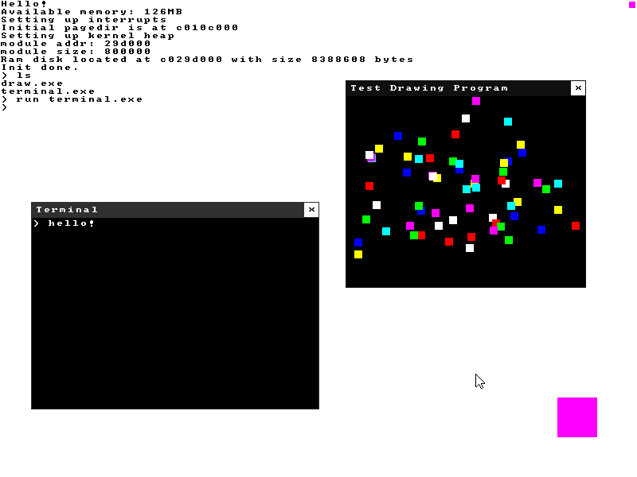

# Untitled 32bit Graphical OS



## Features

* Higher half multitasking kernel
* Essential stuff like paging, interrupts, PS2 mouse/keyboard support
* FAT filesystem via FatFS and a grub provided ramdisk
* Userspace, basic loading of ELF binaries
* Shared memory
* Framebuffer graphics using shared memory
* A single userspace OS API a la winapi

## Architecture/Motivation

This is a completely monolithic OS with a single userspace API for everything (task management, file I/O, window management, etc...). The kernel is not unix based.
All an application needs to do is to include "os.h" and statically link against libos.a (Will be a shared library in the future).

I try to keep things as simple and understandable as possible whilst still being speedy. There are tons of security holes, that's not a priority right now.

Current goal is to port Doom and some other stuff. :)

## Building

Requires clang, 32bit libgcc (gcc-multilib on debian), NASM, mtools and xorriso.

To build:
```
make
```
To build and run (using qemu):
```
make run
```
